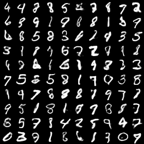
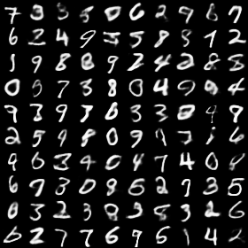

# Amortized SVGD
Amortized SVGD is a simple method which can be utilized to train black box inference networks to draw samples.

We demonstrate two examples utilizing amortized SVGD in this repository:

## Variational Autoencoders

We demonstrate we can draw samples from intractable posteriors by applying amortized svgd to train variational autoencoders with a non-Gaussian encoder, where we add dropout rate 0.3 noise in each layer. The experiments shows that our method can capture the multimodal posterior due to the new structure. 

We use the implementation of [Wu et al., 2017](https://github.com/tonywu95/eval_gen) to evaluate the test log-likelihood.

VAE | SteinVAE
-------- | --------------------
TestLL: -84.68 | Test LL: -84.31
 | 

## Langevin Sampler 

We use a Langevin sampler structrue to sample parameters of bayesian logistic regression.

## Requirements
- Theano
- [pylearn2](https://github.com/lisa-lab/pylearn2) 
- matplotlib
- sklearn
- tqdm

## Paper

We would put the paper on Arxiv soon.
